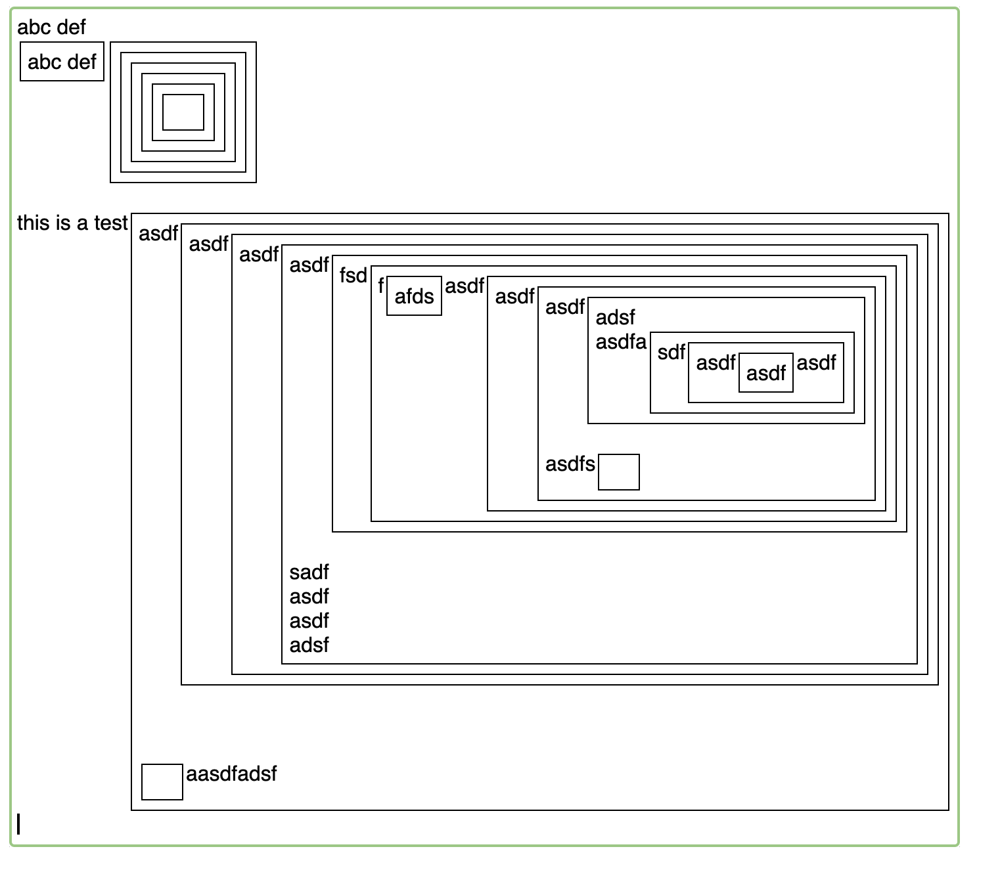

# Boxy - a Boxer-inspired editor

# Screenshot

## Boxy Mouse Bindings
| **Mouse**  | **Action** -| **Description**                              |
|------------|-------------|----------------------------------------------|
| Left Click | Move Cursor |Move cursor to position clicked, inside boxes.|
| Click Drag | Select text |Mark the dragged-over text as selected.       |
|-----------|--------------|-----------------------------------------------|

## Boxy Editor Key Bindings
Below is comprehensive table of key bindings for the visual editor, based on standard Emacs conventions along with custom commands for managing boxes.
Note that if a text region is selected, any insert or delete commands will delete the current region first.

| **Key Binding** | **Action**                            | **Description**                                          |
|-----------------|---------------------------------------|----------------------------------------------------------|
| [               | Insert and enter box                  | Insert a box at the point and enter it.                  |
| (               | Insert and enter box                  | Insert a box at the point and enter it.                  |
| ]               | Exit box                              | Exit current box and put pouint after it.                |
| )               | Exit box                              | Exit current box and put pouint after it.                |
| C-[             | Enter box                             | Enter box after point                  |
| C-(             | Enter box                             | Enter box after point                  |
| C-)             | Exit box to left                      | Exit current box and put point before it             |
| C-)             | Exit box to left                      | Exit current box and put point before it              |
| C-p             | Move cursor up                        | Move cursor to the previous line, maintaining goal column. |
| C-n             | Move cursor down                      | Move cursor to the next line, maintaining goal column.     |
| C-f             | Move cursor forward                   | Move cursor to the next character; enters boxes if present.|
| C-b             | Move cursor backward                  | Move cursor to the previous character; exits boxes if present. |
| C-a             | Move to beginning of line in box      | Move cursor to the start of the current line in box.       |
| C-e             | Move to end of line in box            | Move cursor to the end of the current line in box          |
| C-f             | Move forward                          | Move cursor forward one char or box          |
| C-b             | Move backward                         | Move cursor backward one char or box          |
| C-p             | Move up                               | Move cursor up one row in box box, preserving goal column          |
| C-n             | Move down                             | Move cursor down one row in box box, preserving goal column          |
| Arrow Keys      | Move Up, Down, Left, or Right         | Like Ctrl-P, Ctrl-N, Ctrl-B, Ctrl-F. |
| C-k             | Kill line                             | Delete content from cursor to the end of the line in box   |
| C-y             | Yank (paste)                          | Paste previously cut or copied text/box at the cursor position. |
| C-w             | Cut region                            | Cut the selected region of text or box to the clipboard.   |
| C-c             | Collapse/Expand box                   | Collapse or expand the currently selected box with nested content. |
| C-leftarrow     | Undo                                  | Undo the last action.                                      |
| C-rightarrow    | Redo                                  | Redo the last undone action.                               |
| <printingchar>  | Self insert                           | Insert the character used to invoke this.                  |
| <return>        | Newline                               | Insert a new line and move cursor to beginning. Extend box to fit. |
| C-|             | Evaluate                              | Send the text of the current row to the "evaluate" function and output the resulting box after a pipe symbol on the same line.  |
| <unbound key>   | Unbound key                           | Display "$key undefined" in an alertish yellow rectangle at top of screen, then fade.|
|-----------------|---------------------------------------|----------------------------------------------------------|

## Spec
- [spec.md](spec.md)

## References
- https://klotz.me/thesis.pdf
- https://boxer-project.github.io/boxer-literature/theses/Bochser,%20An%20Integrated%20Scheme%20Programming%20System%20(Eisenberg,%20MIT%20MSc,%201985).pdf
- https://boxer-project.github.io/

