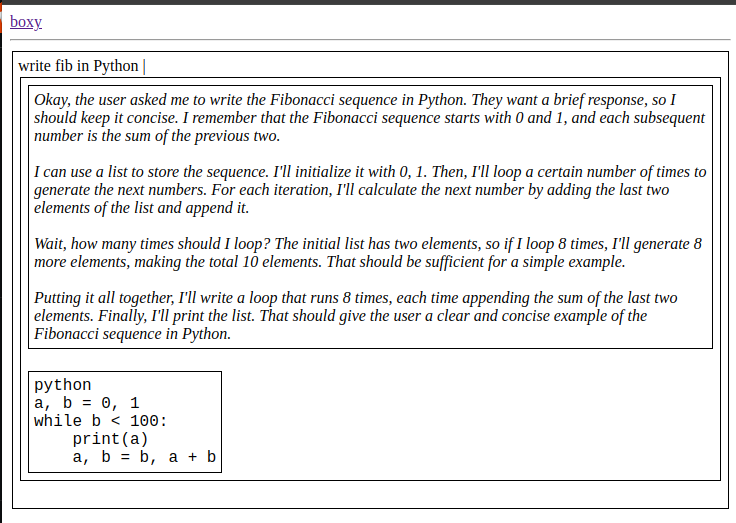
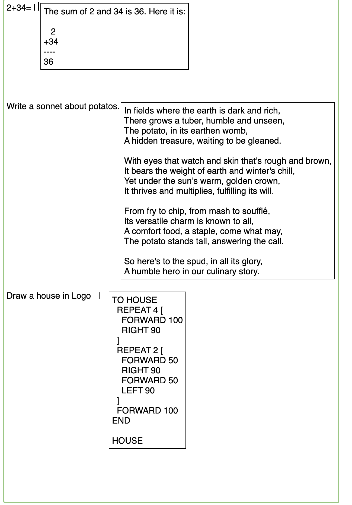
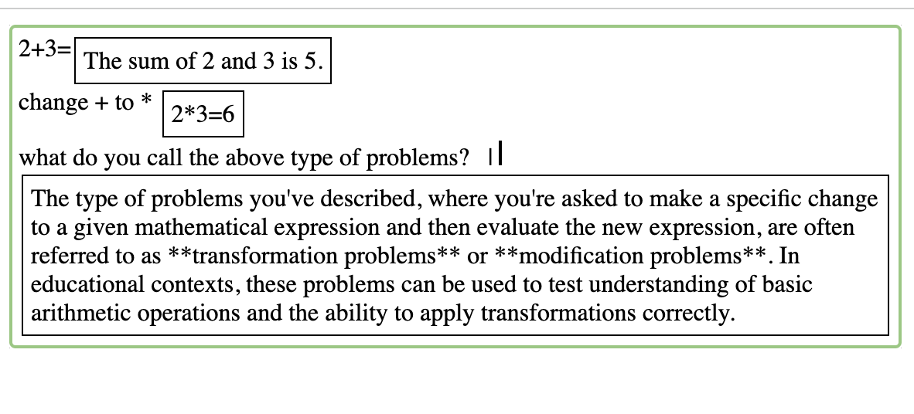
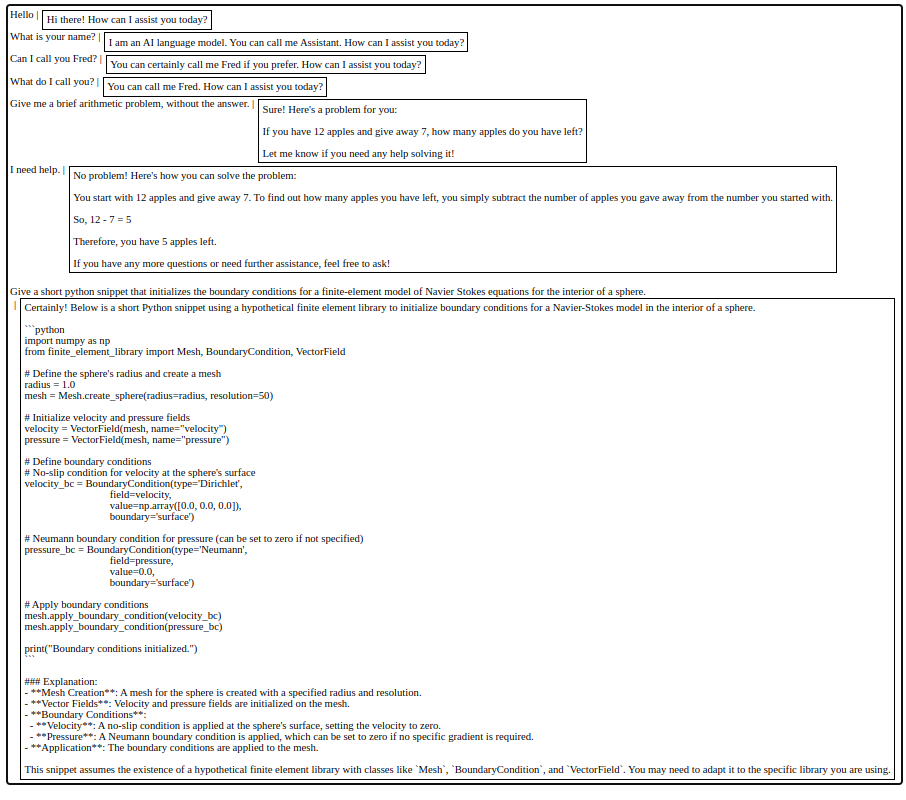
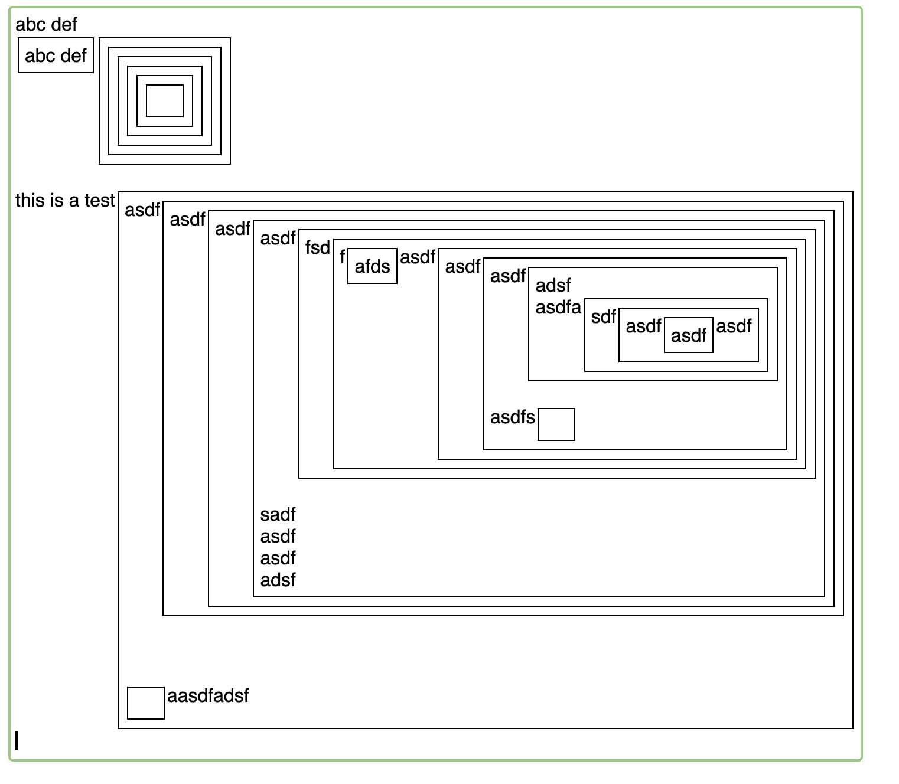
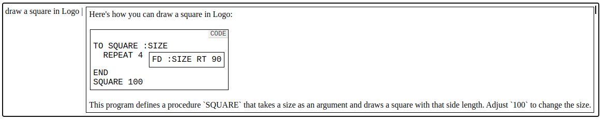
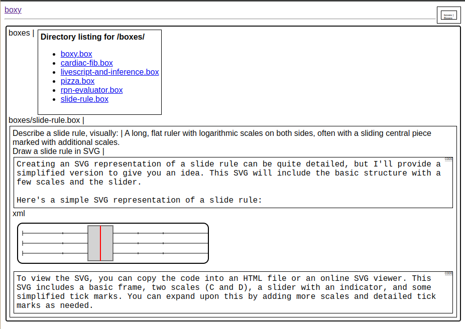
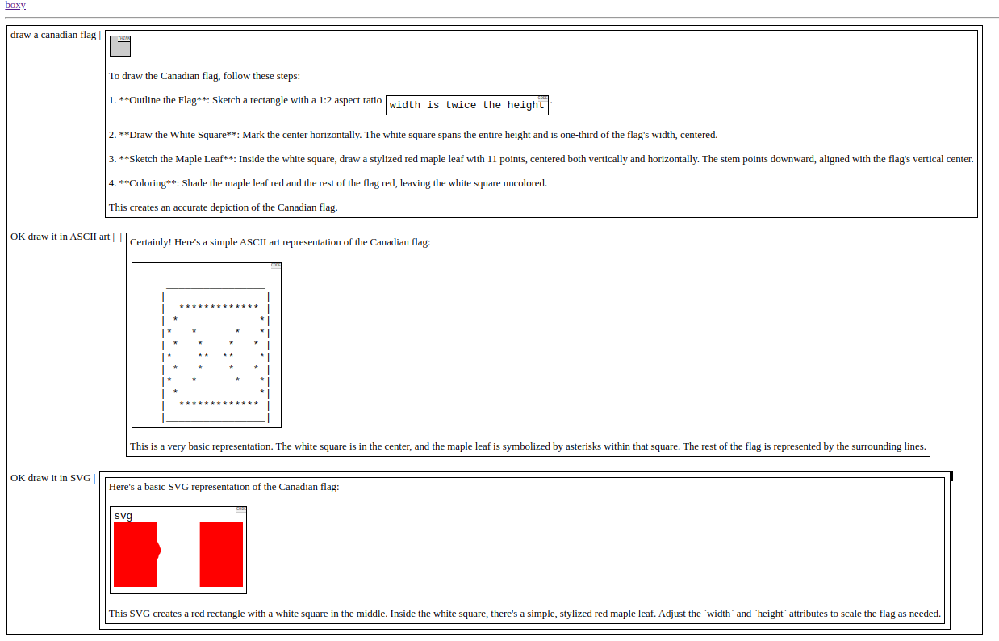
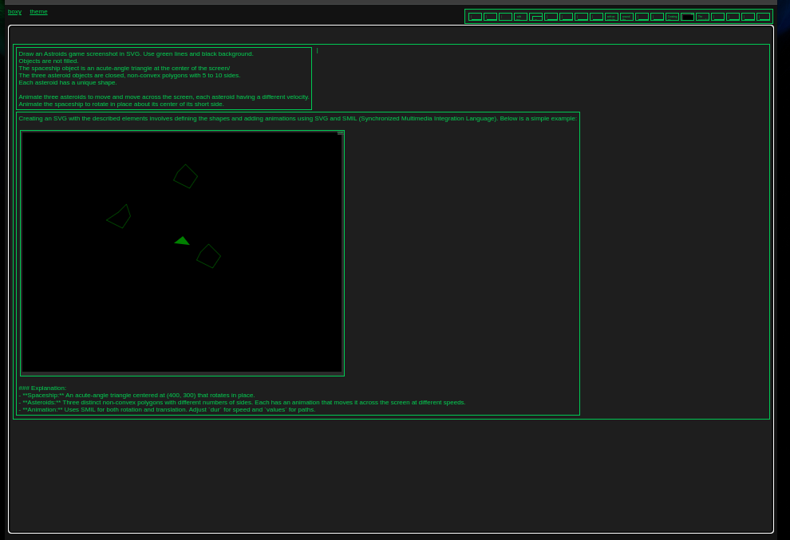
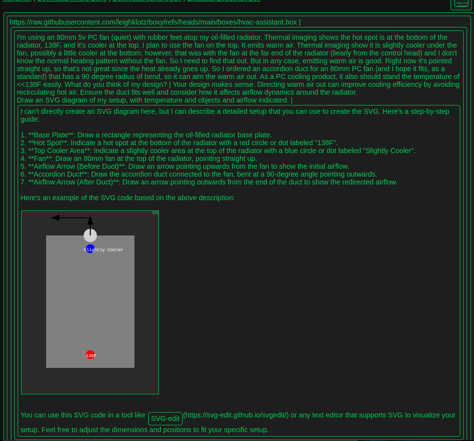

# Boxy - a Boxer-inspired editor

## Boxy Editor Screenshot

Below is a screenshot showing the editor using LLM inference evaluation. Other types of evaluation are possible.



## Boxy Spec
- [docs/spec.md](docs/spec.md)
- [model.md](docs/model.md)

## Starting Boxy
There are two ways to run Boxy in your browser after step 1:

1. Clone this repository
```bash
$ git clone https://github.com/leighklotz/boxy
$ cd boxy
```

2. Open File in Browser
The first way is to visit the URL `file:///home/klotz/wip/boxy/boxy.html` (or whever your have this repository).
You cannot save or load boxes with his method, but it requires no setup.

3. The second way is to run a local HTTP server and visit that URL.
```bash
$ ./run.sh
```

Then visit <a href="http://localhost:8080">http://localhost:8080/boxy.html</a>.

## Boxy Mouse Bindings
| **Mouse**  | **Action** -| **Description**                              |
|------------|-------------|----------------------------------------------|
| Left Click | Move Cursor |Move cursor to position clicked, inside boxes.|
| Click Drag | Select text |Mark the dragged-over text as selected.       |

## Boxy Editor Key Bindings
Below is the current keybinding set for the visual editor.
Boxes are atomic under `C-f` and `C-b`: those commands move over a whole box as one character and do not enter it.
Enter a box explicitly with `C-[` / `C-(` or with a mouse click. If a text region is selected, insert and delete commands replace that region first.

| **Key Binding** | **Action** | **Description** |
|-----------------|------------|-----------------|
| `[` | Insert and enter box | Insert a data box at point and enter it. |
| `(` | Insert and enter code box | Insert a code box at point and enter it. |
| `]`, `)` | Exit box right | Exit the current box and place point after it. |
| `C-[`, `C-(` | Enter adjacent box | Enter the box next to point without changing `C-f`/`C-b` behavior. |
| `C-]`, `C-)` | Exit box left | Exit the current box and place point before it. |
| `C-f`, `Right` | Move forward | Move forward one character or one whole box. |
| `C-b`, `Left` | Move backward | Move backward one character or one whole box. |
| `C-p`, `Up` | Move up | Move up one row while preserving goal column. |
| `C-n`, `Down` | Move down | Move down one row while preserving goal column. |
| `C-a` | Start of line | Move to the start of the current row in the current box. |
| `C-e` | End of line | Move to the end of the current row in the current box. |
| `C-,` | Start of box | Move to the start of the current box. |
| `C-.` | End of box | Move to the end of the current box. |
| `C-q` | Quote next character | Insert the next typed character literally. |
| `Backspace` | Delete backward | Delete the previous character or box. |
| `C-d`, `Delete` | Delete forward | Delete the next character or box. |
| `C-k` | Kill line | Delete to end of row and store the deleted fragment in the clipboard strip. |
| `C-y` | Yank | Reinsert the most recent clipboard item. |
| `C-c` | Copy selection/box | Copy the current selection, or the current box if there is no selection. |
| `C-w` | Cut selection/box | Cut the current selection, or the current box if there is no selection. |
| `C-Shift-B` | Shrink box | Collapse the current box into a single motion unit. |
| `F3` | Expand/contract box | Toggle expanded display for the current box. |
| `Double Click` | Expand shrunken box | Expand a shrunken box and place point by mouse. |
| `|` | Evaluate row | Evaluate the current row and append the result after ` | `. |
| `C-|` | Evaluate box | Evaluate the current box and append the result after ` | `. |
| `<printingchar>` | Self insert | Insert the typed character. Inside code/markdown boxes, raw `[]()` self-insert. |
| `<unbound key>` | Unbound key | Display a temporary undefined-key alert. |

## Modules

## save-restore module
| **Key Binding** | **Action**                            | **Description**                                                         |
|-----------------|---------------------------------------|-------------------------------------------------------------------------|
| Ctrl-o          | Restore                               | Read the URL on the line, fetch the box, and insert the results.|

### Restore:
Put the URL of a boxy box to load into a box and press `Ctrl-o`.

Example:
```
 boxes/cardiac-fib.box *Ctrl-o*
```

The URL is interpreted as relative to the local `./run.sh` Boxy server. If you are instead running Boxy directly from a file:// url, you will not be able to access restore.

Restore handles boxes and some image types. For example, use `boxes/asteroids.box` to retrieve from a local copy of boxy, or a remote URL such as `https://raw.githubusercontent.com/leighklotz/boxy/refs/heads/main/boxes/asteroids.box`.


### Save:
| **Key Binding** | **Action**                            | **Description**                                                         |
|-----------------|---------------------------------------|-------------------------------------------------------------------------|
| Ctrl-^          | downloadSerializedCurrentBox          | Download the current box.                                               |

Place the cursor inside the box and press `Ctrl-^`. This will download the selected text.  
Do this from the editor box to apply get everything. 

Limitations:
- If any markdown boxes are visible, click inside them to exit markdown mode. 
- SVG support is not yet available.

## identity module
| **Key Binding** | **Action**                            | **Description**                                                         |
|-----------------|---------------------------------------|-------------------------------------------------------------------------|
| Tab          | Duplicate                               | Duplicate the box on the line and insert the results.|

## markdown module

| **Key Binding** | **Action**                            | **Description**                                                         |
|-----------------|---------------------------------------|-------------------------------------------------------------------------|
| Ctrl-\          | Markdown                              | Visualize the markdown in the current box. Enter box to edit md text.   |

## llm-infer module

| **Key Binding** | **Action**                            | **Description**                                                         |
|-----------------|---------------------------------------|-------------------------------------------------------------------------|
| |               | LLM Infer                             | Prompt an LLM with the current line and insert the results in a new box.|
| Ctrl-|          | LLM Chat                               | Prompt an LLM with the current box and insert the results in a new box.|

### One inference per line



### One inference per box, continued as a chat



#### Longer chat example



## More Screenshots













## References
- https://klotz.me/thesis.pdf
- https://boxer-project.github.io/boxer-literature/theses/Bochser,%20An%20Integrated%20Scheme%20Programming%20System%20(Eisenberg,%20MIT%20MSc,%201985).pdf
- https://boxer-project.github.io/
