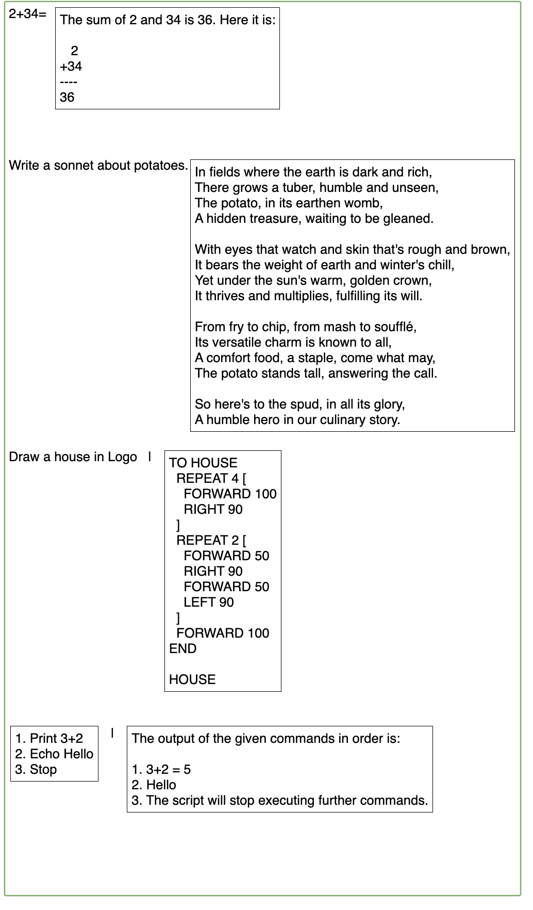

# Boxy - a Boxer-inspired editor

## Boxy Editor Screenshot

Below is a screenshot showing the editor using LLM inference evaluation. Other types of evaluation are possible.


## Boxy Spec
- [docs/spec.md](docs/spec.md)
- [model.md](docs/model.md)

## Starting Boxy
There are two ways to run Boxy in your browser after step 1:

1. Clone this repository
```bash
$ git clone https://github.com/leighklotz/boxy
$ cd boxy
```

2. Open File in Browser
The first way is to visit the URL `file:///home/klotz/wip/boxy/boxy.html` (or whever your have this repository).
You cannot save or load boxes with his method, but it requires no setup.

3. The second way is to run a local HTTP server and visit that URL.
```bash
$ ./run.sh
```

Then visit <a href="http://localhost:8080">http://localhost:8080/boxy.html</a>.

## Boxy Mouse Bindings
| **Mouse**  | **Action** -| **Description**                              |
|------------|-------------|----------------------------------------------|
| Left Click | Move Cursor |Move cursor to position clicked, inside boxes.|
| Click Drag | Select text |Mark the dragged-over text as selected.       |

## Boxy Editor Key Bindings
Below is comprehensive table of key bindings for the visual editor, based on standard Emacs conventions along with custom commands for managing boxes.
Note that if a text region is selected, any insert or delete commands will delete the current region first.

| **Key Binding** | **Action**                            | **Description**                                          |
|-----------------|---------------------------------------|----------------------------------------------------------|
| [               | Insert and enter box                  | Insert a box at the point and enter it.                  |
| (               | Insert and enter box                  | Insert a code box at the point and enter it.                  |
| ]               | Exit box                              | Exit current box and put pouint after it.                |
| )               | Exit box                              | Exit current box and put pouint after it.                |
| C-[             | Enter box                             | Enter box after point                  |
| C-(             | Enter box                             | Enter box after point                  |
| C-)             | Exit box to left                      | Exit current box and put point before it             |
| C-)             | Exit box to left                      | Exit current box and put point before it              |
| C-p             | Move cursor up                        | Move cursor to the previous line, maintaining goal column. |
| C-n             | Move cursor down                      | Move cursor to the next line, maintaining goal column.     |
| C-f             | Move cursor forward                   | Move cursor to the next character; enters boxes if present.|
| C-b             | Move cursor backward                  | Move cursor to the previous character; exits boxes if present. |
| C-a             | Move to beginning of line in box      | Move cursor to the start of the current line in box.       |
| C-e             | Move to end of line in box            | Move cursor to the end of the current line in box          |
| C-f             | Move forward                          | Move cursor forward one char or box          |
| C-b             | Move backward                         | Move cursor backward one char or box          |
| C-p             | Move up                               | Move cursor up one row in box box, preserving goal column          |
| C-n             | Move down                             | Move cursor down one row in box box, preserving goal column          |
| C-q             | Quote Character                       | Insert the next typed character instead of acting on it.      |
| Arrow Keys      | Move Up, Down, Left, or Right         | Like Ctrl-P, Ctrl-N, Ctrl-B, Ctrl-F. |
| Backspace       | Delete char backward                  | Delete the previous character |
| C-d, Delete     | Delete char forward                   | Delete the next character |
| C-k             | Kill line                             | Delete content from cursor to the end of the line in box   |
| C-y             | Yank (paste)                          | Paste top item from clipboard at the cursor position. |
| C-Shift-B       | Shrink box                            | Shrink the currently selected box with nested content. |
| Double Click    | Expand box                            | Expand the clicked box with nested content. |
| C-leftarrow     | Undo                                  | Undo the last action.                                      |
| C-rightarrow    | Redo                                  | Redo the last undone action.                               |
| <printingchar>  | Self insert                           | Insert the character used to invoke this.                  |
| <return>        | Newline                               | Insert a new line and move cursor to beginning. Extend box to fit. |
| &#124;        | Evaluate Row                            | Send the text of the current row to the "evaluate" function and output the resulting box after a pipe symbol on the same line.  |
| C-&#124;        | Evaluate Box                          | Send the text of the current box to the "evaluate" function and output the resulting box after a pipe symbol on the same line.  |
| &lt;unbound key&gt; | Unbound key                       | Display "$key undefined" in an alertish yellow rectangle at top of screen, then fade.|

## Modules

## save-restore module
| **Key Binding** | **Action**                            | **Description**                                                         |
|-----------------|---------------------------------------|-------------------------------------------------------------------------|
| Ctrl-o          | Restore                               | Read the URL on the line, fetch the box, and insert the results.|

### Restore:
Put the URL of a boxy box to load into a box and press `Ctrl-o`.

Example:
```
 boxes/cardiac-fib.box *Ctrl-o*
```

The URL is interpreted as relative to the local `./run.sh` Boxy server. If you are instead running Boxy directly from a file:// url, you will not be able to access restore.

Restore handles boxes and some image types. For example, use `boxes/asteroids.box` to retrieve from a local copy of boxy, or a remote URL such as `https://raw.githubusercontent.com/leighklotz/boxy/refs/heads/main/boxes/asteroids.box`.


### Save:
| **Key Binding** | **Action**                            | **Description**                                                         |
|-----------------|---------------------------------------|-------------------------------------------------------------------------|
| Ctrl-^          | downloadSerializedCurrentBox          | Download the current box.                                               |

Place the cursor inside the box and press `Ctrl-^`. This will download the selected text.  
Do this from the editor box to apply get everything. 

Limitations:
- If any markdown boxes are visible, click inside them to exit markdown mode. 
- SVG support is not yet available.

## identity module
| **Key Binding** | **Action**                            | **Description**                                                         |
|-----------------|---------------------------------------|-------------------------------------------------------------------------|
| Tab          | Duplicate                               | Duplicate the box on the line and insert the results.|

## markdown module

| **Key Binding** | **Action**                            | **Description**                                                         |
|-----------------|---------------------------------------|-------------------------------------------------------------------------|
| Ctrl-\          | Markdown                              | Visualize the markdown in the current box. Enter box to edit md text.   |

## llm-infer module

| **Key Binding** | **Action**                            | **Description**                                                         |
|-----------------|---------------------------------------|-------------------------------------------------------------------------|
| |               | LLM Infer                             | Prompt an LLM with the current line and insert the results in a new box.|
| Ctrl-|          | LLM Chat                               | Prompt an LLM with the current box and insert the results in a new box.|

### One inference per line



### One inference per box, continued as a chat


#### Longer chat example


## More Screenshots


## References
- https://klotz.me/thesis.pdf
- https://boxer-project.github.io/boxer-literature/theses/Bochser,%20An%20Integrated%20Scheme%20Programming%20System%20(Eisenberg,%20MIT%20MSc,%201985).pdf
- https://boxer-project.github.io/
